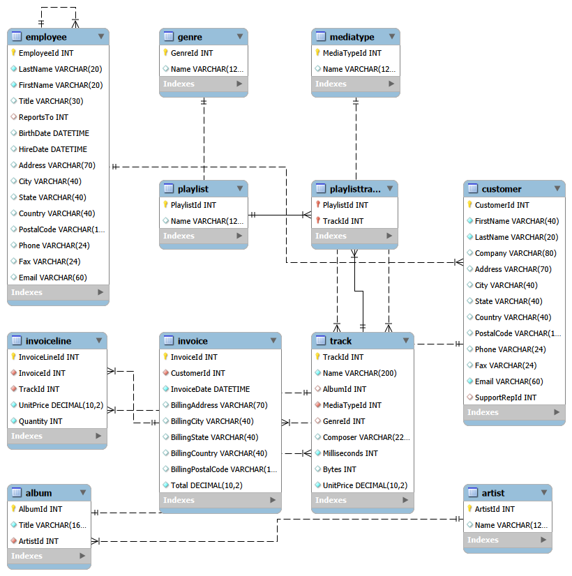

# Chinook Music Store — SQL Portfolio Project


An end-to-end SQL analysis of the Chinook digital music store database, covering customer behaviour, revenue trends, artist performance, and genre popularity across 59 customers, 3,503 tracks, and 412 invoices.

---

## Dataset

The [Chinook Database](https://github.com/lerocha/chinook-database) is a sample database representing a digital music store, modelled after iTunes. It contains 11 tables: Artist, Album, Track, Genre, MediaType, Employee, Customer, Invoice, InvoiceLine, Playlist, and PlaylistTrack.

### Entity Relationship Diagram



---

## Tools Used

- MySQL 8.x
- MySQL Workbench

---

## Project Structure

```
chinook-sql-project/
├── data/
│   ├── raw/          # Original Chinook dataset (11 tables as CSV)
│   └── results/      # Query output for each analysis question
├── sql/
│   └── chinook_analysis.sql   # All queries
└── assets/
    └── erd_diagram.png
```

---

## Analysis Questions

### 🟢 Basic

| # | Question | Result |
|---|----------|--------|
| Q1 | Which countries do customers come from? | [View](data/results/Q1_customers_by_country.csv) |
| Q2 | Top 10 longest tracks? | [View](data/results/Q2_top10_longest_tracks.csv) |
| Q3 | How many tracks per genre? | [View](data/results/Q3_tracks_by_genre.csv) |
| Q4 | What is total revenue overall? | [View](data/results/Q4_total_revenue.csv) |

### 🟡 Medium

| # | Question | Result |
|---|----------|--------|
| Q5 | Top 5 customers by total spend? | [View](data/results/Q5_top5_customers_by_spend.csv) |
| Q6 | Which artist has the most tracks? | [View](data/results/Q6_artist_most_tracks.csv) |
| Q7 | Monthly revenue trends over time? | [View](data/results/Q7_monthly_revenue_trends.csv) |
| Q8 | Which employee manages the most revenue? | [View](data/results/Q8_employee_revenue_managed.csv) |

### 🔴 Advanced

| # | Question | Result |
|---|----------|--------|
| Q9 | Running total spend per customer over time? | [View](data/results/Q9_customer_running_totals.csv) |
| Q10 | Which tracks have never been purchased? | [View](data/results/Q10_unpurchased_tracks.csv) |
| Q11 | Customers ranked by spend within each country? | [View](data/results/Q11_customers_ranked_by_country.csv) |
| Q12 | Most popular genre per country by revenue? | [View](data/results/Q12_popular_genre_by_country.csv) |

---

## Key Findings

- **Rock dominates globally** — Rock is the top revenue-generating genre in the majority of countries including the USA ($1,526) and Canada ($989)
- **Top customer** — the highest spending customer accounts for significantly more revenue than the average, suggesting a VIP segment worth targeting
- **Unpurchased tracks** — a significant portion of the catalogue has never appeared on an invoice, highlighting potential dead inventory
- **Revenue is consistent** — monthly revenue trends show relatively stable income with no dramatic seasonal spikes

---

## How to Run

1. Import `Chinook_MySql.sql` into MySQL
2. Open `sql/chinook_analysis.sql` in MySQL Workbench
3. Execute queries individually or all at once

---

**Brenda Homera** · [LinkedIn](https://www.linkedin.com/in/bhomera) · [Email](mailto:brendahomera12@gmail.com)
